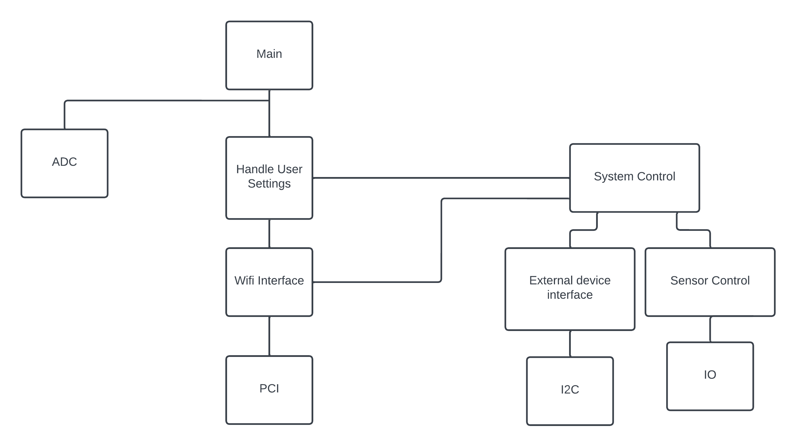

# Automatic greenhouse

A Module which can be attached to any greenhouse. 
The Main module will be shipped with a temperature, humidity and soil moisture sensor.
On top, it also contains an ethernet adapter which can be used with a SIM-Card or ethernet cable, to communicate with the server where the user can see information about his greenhouse and define thresholds to trigger events.
There are also two predefined I2C connections where the user can attach a water pump with motor or a skylight with motor.

## Requirements

- Stm32F3Discovery Board with `ARM Cortex-M4`
- Wifi W5500 module
- 3x Timer interrupt
- DHT 11 Temperature sensor
- Soil moisture sensor
- provide the I2C endpoints with pre-attached cables (which are labeled)
- any device which can be used as a server or a real server where the User-Interface will be hosted

## Block diagram

## Hierarchy of Control diagram

## Device flow

## Software description

- WIP

## Modules

- Core
  - timers
  - power management
  - web communication device
  - web server
- IMU driver
- Flash access
- Charging

## External libraries used

- flask, FastAPI or Django (depending on interface)
- SqlAlchemy or DjangoORM
- Docker, Docker Compose

## CLI commands

- version
- tempsensor_on
- tempsensor_off
- tempsensor_data
- soil_on
- soil_off
- soil_data
- humidity_on
- humidity_off
- humidity_data
- waterpump_ic2_on
- waterpump_ic2_off
- roof_light_ic2_on
- roof_light_ic2_off
- send_test_request

## Toolchain

- CubeIDE + Clion + PyCharm + Docker + DockerCompose
- Documentation via git-commits and `README.md`

## MVP

- Server has basic interface to see sensor data and set device settings (no focus on UI/UX)
- Device can send data to webserver
- Device can send I2C when thresholds are received, for the beginning when lower threshold is reached 
