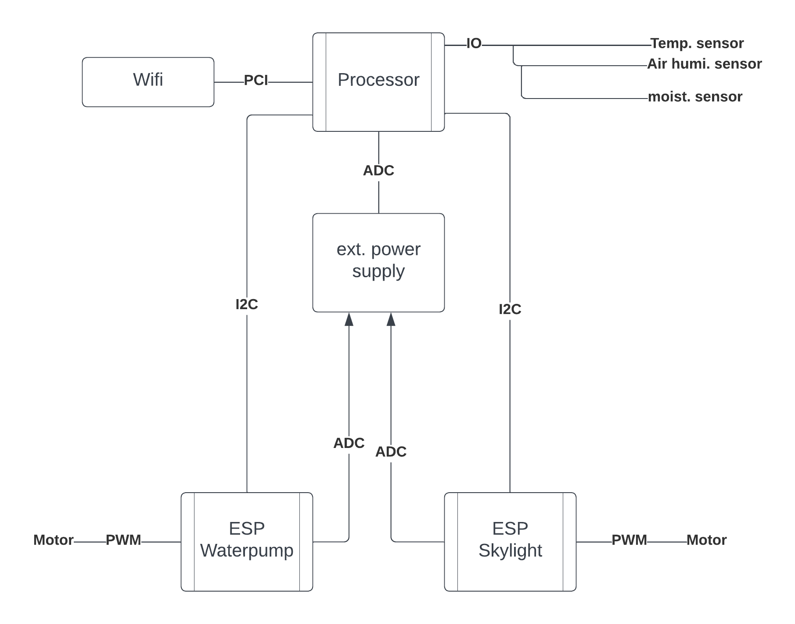
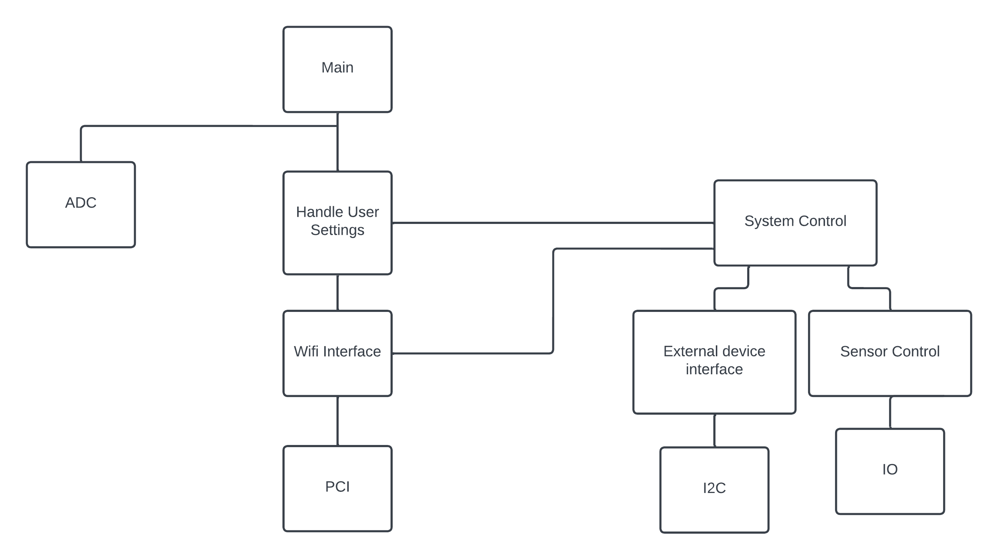

# Automatic greenhouse

## What does it do?

- The automatic greenhouse is designed to measure air humidity, soil moisture and room temperature
- It controls the skylight to reduce humidity and room temperature
- The attached water pump will be used to increase humidity and soil moisture
- The whole system can be controlled via a web interface to adjust these parameters to the farmers need

## What general components are needed

- a board with Wi-Fi connection
- three sensors (air humidity, soil moisture, room temperature)
- 2 ESP boards to control the water pump and the skylight motor
- external power supply

## Block diagram

## Hierarchy of Control diagram
