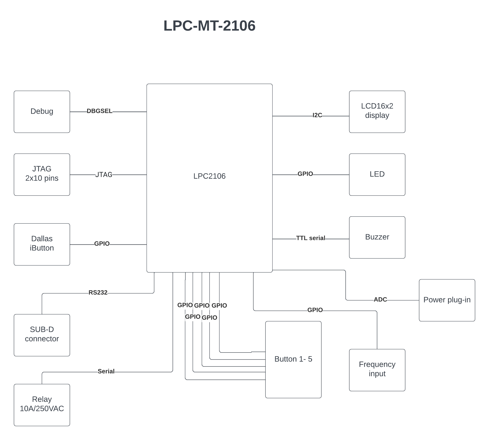

# Week 2 assignment (Investigate Project Board)
- the board I need to investigate is the __LPC-MT-2106__

## What kind of processor is it
- LPC2106 which is a single-chip 32-bit ARM7TDMI-S microcontroller

## How much Flash and RAM does it have? Any other memory types?
- Flash: 128 kbytes
- RAM: 64 kB

## Does it have any special peripherals?
- besides 5 buttons and a status LED it also have
- LCD16x2 display
- SUB-D 9 pin connector
- Buzzer
- Relay with 10A/250VAC contacts
- JTAG connector
- Dallas iButton port
- Frequency input

## If it has an ADC, what are the features?
- /

## How much does the board cost vs what the processor costs? Is the processor in stock anywhere?
- Board costs: 59.95 EUR (Olimex.com) - 62,60 EUR (Mouser Electronics)
- Processor costs (LPC2106FBD48/01,15): 25,84 EUR (Mouser Electronics)
- In Stock (LPC2106FBD48/01,15): 6 (Mouser Electronics)
  https://eu.mouser.com/ProductDetail/NXP-Semiconductors/LPC2106FBD48-0115?qs=LOCUfHb8d9ucbTrHZHjaEg%3D%3D